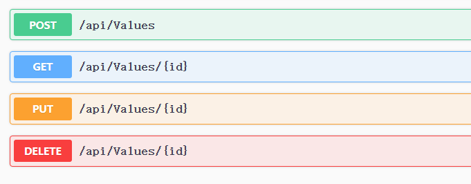

# Swashbuckle使用记录

[toc]

### 1、引入Swashbuckle包

vs中直接使用包管理器搜索 Swashbuckle.AspNetCore ，进行安装

nuget： Install-Package Swashbuckle.AspNetCore -Version 6.2.3   

dotnet CLI ： dotnet add 项目名.csproj package Swashbuckle.AspNetCore -v 6.2.3

不论何种方法请自行选择合适的版本号

### 2、注册服务与中间件

注册服务：

``` 
// 注册Swashbuckle
            services.AddSwaggerGen(
                    c =>
                    {
                        c.SwaggerDoc("v1", new Microsoft.OpenApi.Models.OpenApiInfo
                        {
                            // 配置相关文档相关信息，具体参数请研究OpenApiInfo
                            Version = "v1",
                            Title = "MyBlog"
                        });
                    }
                );
```

注册中间件：

```
			// 注册接口文档中间件
            app.UseSwagger();
            app.UseSwaggerUI(
                option =>
                {
                    // 设置SwaggerGen生成地址，并起一个名字
                    option.SwaggerEndpoint("/swagger/v1/swagger.json", "v1");

                    // 设置文档的路由前缀 RoutePrefix默认值为swagger
                    // 则访问路径为 https://localhost:<port>/swagger/index  
                    // 将其设置为空后 https://localhost:<port>/index
                    // 可能会与其他路由冲突，合理利用
                    option.RoutePrefix = string.Empty;
                }
            );
```

### 3、项目启动默认显示接口文档

只需将launchSettings.json中默认访问路径改为接口文档的路径即可，第二步中将接口文档的默认路径设置为空则launchSettings.json修改为

```
{
  "profiles": {
    "Blog.Core": {
      "commandName": "Project",
      "dotnetRunMessages": true,
      "launchBrowser": true,
      "launchUrl": "", // 修改此处
      "applicationUrl": "http://localhost:5241",
      "environmentVariables": {
        "ASPNETCORE_ENVIRONMENT": "Development"
      }
    }
  }
}
```

### 4、给接口文档添加注释

当接口较为复杂时，开发人员不易看懂，因此给接口文档添加注释



编辑项目文件添加生成XML文件

```
  <PropertyGroup>
  	 // 自动生成xml
	 <GenerateDocumentationFile>true</GenerateDocumentationFile>
	 // 当某个控制器、接口、字段未写注释时，vs自动列为警告，忽略该警告
	 <NoWarn>$(NoWarn);1591</NoWarn>
  </PropertyGroup>
  
  忽略警告等价于
  #pragma warning disable CS1591,cs1592...
  该预处理命令直接写在类中即可
  比如
  	/// <summary>
    /// 控制器注释
    /// </summary>
    [Route("api/[controller]")]
    [ApiController]
    #pragma warning disable CS1591
    public class ValuesController : ControllerBase
```

配置读取XML文件

```
 			// 注册Swashbuckle
            services.AddSwaggerGen(
                    c =>
                    {
                        c.SwaggerDoc("v1", new Microsoft.OpenApi.Models.OpenApiInfo
                        {
                            // 配置相关文档相关信息，具体参数请研究OpenApiInfo
                            Version = "v1",
                            Title = "MyBlog"
                        });

                        // 获取XML文件路径，默认生成路径为当前程序的生成路径，文件名为 项目名.xml
                        var xmlFilename = $"{Assembly.GetExecutingAssembly().GetName().Name}.xml";
                        // 加载该xml文件
                        c.IncludeXmlComments(Path.Combine(AppContext.BaseDirectory, xmlFilename));
                    }
                );
```

编写接口注释

```
 		/// <summary>
        /// 获取所有信息
        /// </summary>
        /// <returns></returns>
        [HttpGet]
        public IEnumerable<string> Get()
        {
            return new string[] { "value1", "value2" };
        }
```

效果


### 5、给控制器添加注释

```
// 注册Swashbuckle
            services.AddSwaggerGen(
                    c =>
                    {
                        c.SwaggerDoc("v1", new Microsoft.OpenApi.Models.OpenApiInfo
                        {
                            // 配置相关文档相关信息，具体参数请研究OpenApiInfo
                            Version = "v1",
                            Title = "MyBlog"
                        });

                        // 获取XML文件路径
                        var xmlFilename = $"{Assembly.GetExecutingAssembly().GetName().Name}.xml";                        
                        c.IncludeXmlComments(Path.Combine(AppContext.BaseDirectory, xmlFilename),true);// 添加true，即可生成控制器注释
                    }
                );
```

### 6、给model添加注释

当model与api为一个项目时，直接用注释正常添加即可

当model与api为两个项目时，先在model项目中启用生成xml。注因为api项目引入Swashbuckle所以api项目自动勾选，其他项目需要手动勾选


配置读取xml文件

```
// 注册Swashbuckle
            services.AddSwaggerGen(
                    c =>
                    {
                        c.SwaggerDoc("v1", new Microsoft.OpenApi.Models.OpenApiInfo
                        {
                            // 配置相关文档相关信息，具体参数请研究OpenApiInfo
                            Version = "v1",
                            Title = "MyBlog"
                        });

                        // 获取XML文件路径
                        var xmlFilename = $"{Assembly.GetExecutingAssembly().GetName().Name}.xml";
                        c.IncludeXmlComments(Path.Combine(AppContext.BaseDirectory, xmlFilename),true);
                        
                        // 包含model.xml文件
                        c.IncludeXmlComments(Path.Combine(AppContext.BaseDirectory, "Blog.Core.Model"), true);
                    }
                );
```

效果：


### 7、不显示某些接口、控制器

直接在对应元素上写 [ApiExplorerSettings(IgnoreApi = true)] 即可

### 8、参考文档

[Swashbuckle 和 ASP.NET Core 入门 | Microsoft Learn](https://learn.microsoft.com/zh-cn/aspnet/core/tutorials/getting-started-with-swashbuckle?view=aspnetcore-6.0&tabs=visual-studio)

[从壹开始前后端分离【 .NET Core2.0/3.0 +Vue2.0 】框架之四 || Swagger的使用 3.2 - 老张的哲学 - 博客园 (cnblogs.com)](https://www.cnblogs.com/laozhang-is-phi/p/9507387.html)

